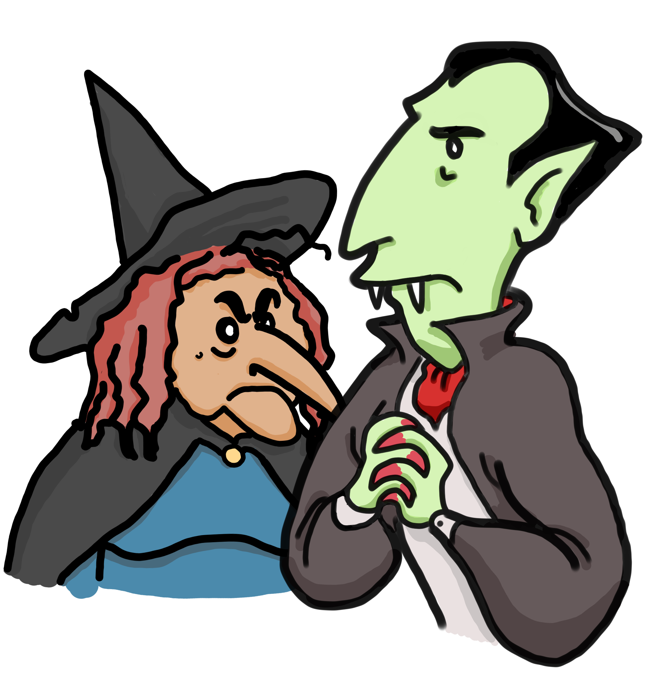

# MULTIPLY

### Video Demo:  <https://youtu.be/zTOiabBBTIw>

### Description:
Multiply is a Flask app, which helps kids to practice their multiplying skills in a fun way. The app presents the user with a game in which they must answer a number of multiplication problems correctly in order to win the challenge and defeat one of the two monster NPCs currently available.

### How it was made:
The main components of the app are written in Python, using SQL to build a database that holds the user's registration data, as well as detailed info of their performance during each session. The framework used is Bootstrap version 5.1.3.

### What it does:
Once the user is logged in, they are welcomed to the app and a short story or introduction invites them to participate in a "game of wits" against one of our monsters, which is randomly selected once the user decides to begin the exercise.

An exercise consists of **10 multiplication problems**. The user has to answer **at least 6 correctly**, each within a 20-second timeframe, in order to beat the game. All results (correct and incorrect) are stored in the database to build a "history" table, which they or their parents can later check to see progress. 2 numbers from 0 to 9 are randomly picked for each problem. The two numbers from each incorrect answer (From now on, **"incorrect numbers"**) are stored and given priority through weights when selecting a new couple of random number. That way, the app helps the user focus in the operations they have more trouble with.

To reward progress, only the "incorrect numbers" from the last three sessions are given priority when choosing random numbers. Recognizing that users may not use the app regularly, we also limit "incorrect numbers" to sessions up to one month old.

To prevent cheating, questions not answered within the 20-second timeframe, count as incorrect. Both numbers in the problem are stored as "incorrect numbers".

Each answer, correct or incorrect triggers a reaction from the selected monster NPC. The reaction includes an animation as well as a randomly selected phrase. There are about five different phrases for each of the user's actions (The game starts, answer is correct, answer is incorrect, the user wins, the monster wins), as well as five animations. Each monster has its own set of phrases and animations.

Since each answer is revealed to be correct or incorrect in a new screen, with the monster's phrase and animation as well as a "continue" button, users can take all the time they want between questions. Unfinished exercises (sets of 10 questions) don't have any consequences for the user. Each new session starts with a new exercise. To help users learn from their mistakes, the screen triggered by an incorrect answer also has the correct answer in green.

Inspired by a penalty shoot-out, the score is kept through checkmarks and crosses that appear in the upper-right corner of the screen with each answer, forming a line.

Once the exercise ends, a new screen announces whether the user won or lost the challenge. There is also an animation and phrases that change according to the result. If the user is victorious, they are also awarded a bronze, silver, gold or platinum medal depending on how many duels have they won in the same day. Once awarded, medals are displayed in each screen of the consecutive exercises for the rest of the day. After the exercise's result is announced and medals are given away, the user gets to choose between starting all over again and viewing their results through the "history" table. There, they can see day by day how many exercises were started, how many answers were correct, how many were wrong and how many villains were defeated.

The navigation bar allows the user to return to the index at any given time, check the "history" table or learn how to play the game.

**The app was never intended to teach kids how multiplication works**. It's simply a tool that helps, through memorization, in learning the multiplication table up to 9 x 9.

### The monsters:
There are two monster NPCs currently available: **Berenice, the witch, and Count Emil, the vampire**.

### Improvements:
There's still plenty of room for improvements. Here are some of the ideas I have, as well as others that were discarded.
- Focusing in making the game a fun experience, I could add more NPCs, as well as different storylines.
- I could also expand the app's reach to cover other arithmetic operations like addition and substraction.
- In order to highlight the user's progress, I could add a new column showing the percentage of correct answers for each day.
- Another idea I had at the beggining of the process was to add some sort of "new game +" mode with inverted roles, where the user would mark as correct or incorrect the monster's answers to each question. Thinking that new mode would be easier than the regular mode, I finally went against it.